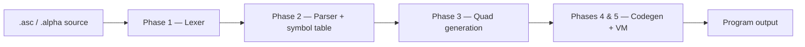

# Alpha Compiler

A multi-phase compiler for the **Alpha** programming language, developed for the [HY-340](https://www.csd.uoc.gr/~hy340/) course (*Languages & Compilers*) at the University of Crete (2024–2025).

Alpha is a dynamically typed language with functions, tables (objects), closures, and a standard library. This repository implements the full compilation pipeline—from lexical analysis through intermediate code generation to execution on a custom stack-based virtual machine.

## Compiler pipeline



| Phase | Directory | Executable | Description |
|-------|-----------|------------|-------------|
| 1 | `Phase_1/` | `al` | Tokenizes source files with [Flex](https://github.com/westes/flex). |
| 2 | `Phase_2/` | `parser` | Parses Alpha grammar with [Bison](https://www.gnu.org/software/bison/); builds and prints the symbol table. |
| 3 | `Phase_3/` | `intermediate` | Performs semantic analysis and emits intermediate **quads** (three-address code). |
| 4 & 5 | `Phases_4_5/` | `final` | Translates quads to VM bytecode, writes `out.txt` / `out.abc`, and runs the program on the Alpha Virtual Machine (AVM). |

Each phase directory contains source under `code/`, a `Makefile`, and tests under `tests/`.

## Prerequisites

- **GCC** (C compiler)
- **GNU Make**
- **[Flex](https://github.com/westes/flex)** — lexical analyzer generator
- **[Bison](https://www.gnu.org/software/bison/)** — parser generator

On Debian/Ubuntu:

```bash
sudo apt install build-essential flex bison
```

## Building

Build a single phase by entering its `code/` directory and running `make`:

```bash
cd Phase_1/code && make        # produces ./al
cd Phase_2/code && make        # produces ./parser
cd Phase_3/code && make        # produces ./intermediate
cd Phases_4_5/code && make     # produces ./final
```

## Usage

### Phase 1 — Lexical analysis

```bash
cd Phase_1/code
./al <input.alpha> [output]
```

Writes a token stream to stdout or to the optional output file.

### Phase 2 — Syntax analysis

```bash
cd Phase_2/code
./parser <input.asc> [output]
```

Parses the program and prints symbol-table insertions. Syntax or semantic errors are reported as `Error:` lines.

### Phase 3 — Intermediate code

```bash
cd Phase_3/code
./intermediate [input.asc]
```

On success, prints quads to stdout and writes `quads.txt`. Set `ALPHA_DEBUG=1` to enable debug output on stderr.

### Phases 4 & 5 — Full compiler + VM

```bash
cd Phases_4_5/code
./final [input.asc]
```

Compiles the source, emits target VM instructions, writes `out.txt` (text) and `out.abc` (binary), then executes the program. Built-in library functions include `print`, `typeof`, `totalarguments`, and `argument`.

## Testing

Every phase includes automated tests via Make targets:

| Phase | Command | Notes |
|-------|---------|-------|
| 1 | `make run-tests` | Runs `../tests/*.alpha` |
| 2 | `make run-tests` | Covers `tests/Working/` and `tests/Errors/` |
| 3 | `make run-tests` | Compares output against `tests/out/expected/` when present |
| 4 & 5 | `make run-tests` | Runs all `*.asc` files; `*_err_*` tests expect a non-zero exit |

## Project layout

```
Alpha-compiler/
├── Phase_1/          # Lexer (Flex)
├── Phase_2/          # Parser + symbol table (Bison)
├── Phase_3/          # Quad generation + backpatching
└── Phases_4_5/       # Code generation, AVM runtime, end-to-end tests
```

## Team

| ID | Name |
|----|------|
| **csd5171** | Fytaki Maria |
| **csd5310** | Rafail Drakakis |
| **csd5082** | Theologos Kokkinellis |
